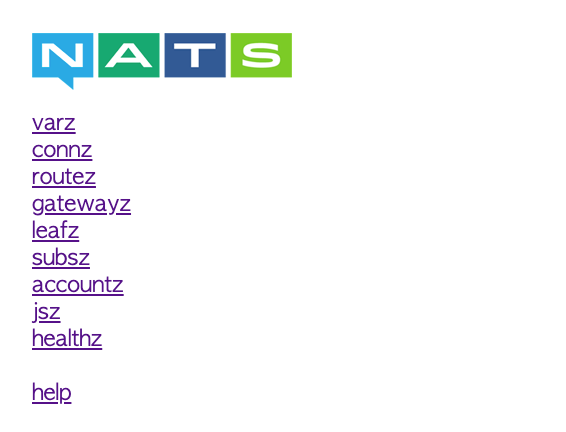

# microservices with Nats

## requirements

Nats docker

```
$ docker-compose up -d
```

you can checkout the Nats monitoring web api at http://localhost:8222/



there you can see some general data about the service.

## running the project

after running the Nats service you need to go to each folder
`gateway` and `microservice` and start using

```
$ yarn start
```

then all you need to do is send Get request to the gateway
there are two requests:

- http://localhost:3003/sendNormalEvent
- http://localhost:3003/sendLongEvent

the normal event just sends the event to the microservice and on the microservice side we just print the data.

and on the long event we send to the microservice an event and on the microservice side we wait for 10 seconds (simulating a job that takes time) and then print the data

the [Nats client package](https://github.com/nats-io/nats.js#connection-options) does not come with alot of configuration out of the box.
There is no message acknowledgment there is no message persistence, messages are lost if there is no consumer on the queue.
